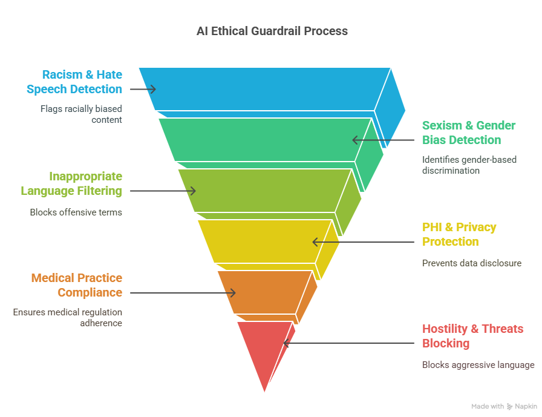

    
# Ethical Guardrails 

## This solution includes a set of Ethical Guardrails designed to detect and prevent inappropriate, biased, or harmful outputs from AI systems.

    

    

 
# 🧩 Ethical Guard Rails

#### This solution includes a set of Ethical Guardrails designed to detect and prevent inappropriate, biased, or harmful outputs from AI systems.

> Created by **ThriveAI  ...      Frank Metty, Al Seoud, Joe Eberle**  
> 🗓️ Started April 18, 2025 
> 📫 Contact [josepheberle@outlook.com](mailtojosepheberle@outlook.com)  
> 🔗 GitHub [JoeEberle](httpsgithub.comJoeEberle)

## 🧠 Ethical Guardrails 

These guardrails are continuously evolving to align with emerging ethical standards, legal requirements, and community values — supporting safe, inclusive, and responsible AI use.

## 🛡️ Ethical Guardrails Overview
This solution includes a set of Ethical Guardrails designed to detect and prevent inappropriate, biased, or harmful outputs from AI systems. These checks operate in real time and provide an added layer of accountability and safety.

## ⚖️ Guardrail Categories
#### Racism & Hate Speech Detection
Flags content that includes racial slurs, stereotypes, or any language promoting racial hostility or division.

#### Sexism & Gender Bias
Identifies and blocks statements that perpetuate **gender based discrimination**, stereotypes, or exclusion.

#### Inappropriate or Offensive Language
Filters **profane, sexually explicit, or otherwise offensive terms** that are unsuitable for professional or public use.

#### PHI & Privacy Protection
Prevents the disclosure of **Protected Health Information (PHI)**, personal identifiers, or sensitive private data.

#### Practicing Medicine
Detects when the AI is attempting to diagnose, prescribe, or make clinical decisions without a licensed provider — ensuring compliance with medical regulations.

#### Hostility & Threats
Blocks language that includes **violence, bullying, incitement, or aggressive intent** toward individuals or groups.

These guardrails are continuously evolving to align with emerging ethical standards, legal requirements, and community values — supporting safe, inclusive, and responsible AI use.

 

    

    
## Getting Started

The goal of this solution is to **Jump Start** your development and have you up and running in 30 minutes. 

To get started with the **Ethical Guardrails** solution repository, follow these steps:
1. Clone the repository to your local machine.
2. Install the required dependencies listed at the top of the notebook.
3. Explore the example code provided in the repository and experiment.
4. Run the notebook and make it your own - **EASY !**
    
## Solution Features

- Easy to understand and use  
- Easily Configurable 
- Quickly start your project with pre-built templates
- Its Fast and Automated
- Saves You Time 

## ⚙️ Key Features

- ✅ **Self Documenting** Automatically identifies and annotates major steps in a notebook, making the codebase readable and well structured.
- ✅ **Self Testing** Includes built in **unit tests** for each function to validate logic and ensure code reliability.
- ✅ **Easily Configurable** Uses a simple **config.ini** file for centralized settings and easy customization through key value pairs.
- ✅ **Talking Code** explains itself through inline commentary, helping you understand both **what** it does and **why** it does it.
- ✅ **Self Logging** extends Python’s standard **logging** module for **step by step runtime insights**.
- ✅ **Self Debugging** Includes debugging hooks and detailed error tracing to simplify development and troubleshooting.
- ✅ **Low Code or  No Code** Designed to minimize complexity — most full solutions are under 50 lines of code.
- ✅ **Educational** Each template includes educational narrative and background context to support learning, teaching, and collaborative development.

    
## List of Figures
    
    

## Github https://github.com/JoeEberle/ - Email  josepheberle@outlook.com 
    

    