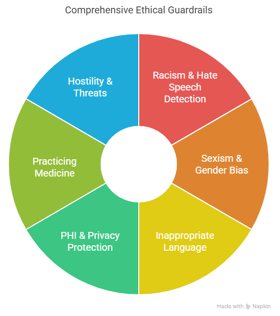

# 🧩 Ethical Guard Rails

#### This solution includes a set of Ethical Guardrails designed to detect and prevent inappropriate, biased, or harmful outputs from AI systems.

> Created by **ThriveAI  ...      Frank Metty, Al Seoud, Joe Eberle**  
> 🗓️ Started: April 18, 2025 
> 📫 Contact: [josepheberle@outlook.com](mailto:josepheberle@outlook.com)  
> 🔗 GitHub: [JoeEberle](https://github.com/JoeEberle/)

## 🧠 Ethical Guardrails 

These guardrails are continuously evolving to align with emerging ethical standards, legal requirements, and community values — supporting safe, inclusive, and responsible AI use.

## 🛡️ Ethical Guardrails Overview
This solution includes a set of Ethical Guardrails designed to detect and prevent inappropriate, biased, or harmful outputs from AI systems. These checks operate in real time and provide an added layer of accountability and safety.

## ⚖️ Guardrail Categories
### 🛑 Racism & Hate Speech Detection
Flags content that includes racial slurs, stereotypes, or any language promoting racial hostility or division.

### 🛑 Sexism & Gender Bias
Identifies and blocks statements that perpetuate **gender based discrimination**, stereotypes, or exclusion.

### 🛑 Inappropriate or Offensive Language
Filters **profane, sexually explicit, or otherwise offensive terms** that are unsuitable for professional or public use.

### 🛑 PHI & Privacy Protection
Prevents the disclosure of **Protected Health Information (PHI)**, personal identifiers, or sensitive private data.

### 🛑 Practicing Medicine
Detects when the AI is attempting to diagnose, prescribe, or make clinical decisions without a licensed provider — ensuring compliance with medical regulations.

### 🛑 Hostility & Threats
Blocks language that includes **violence, bullying, incitement, or aggressive intent** toward individuals or groups.

These guardrails are continuously evolving to align with emerging ethical standards, legal requirements, and community values — supporting safe, inclusive, and responsible AI use.

## Git Commands 
1. git init
2. git add README.md
3. git commit -m "first commit"
4. git branch -M main
5. git remote add origin https://github.com/JoeEberle/ethical_guardrails.git
5. git push -u origin main

